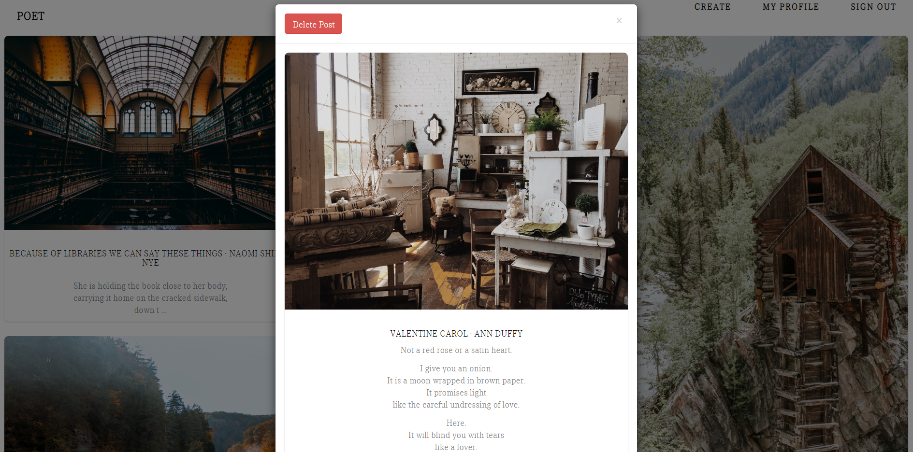
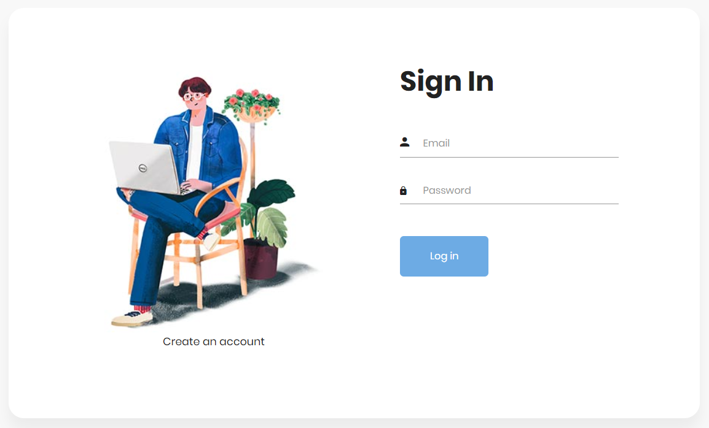

# Poet
A platform for sharing poetry paired with visual
photography.

###  Specifications:
* Create New User Account
* Upload photos
* Add/Edit/Delete Poem
* View public and personal poems
* Write/Reply comments

* Mongo DB
* Vanilla UI

### Quick start

#### change into the repo directory
`cd src`

#### install
`npm install`

#### serve               
`npm start`
