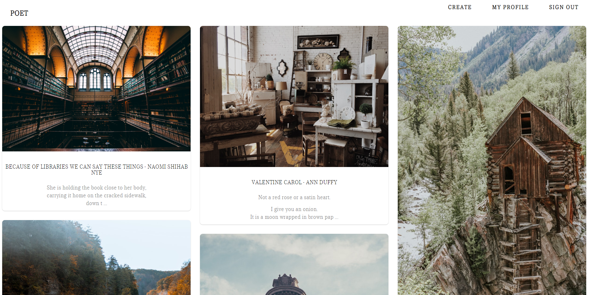

# Poet
A platform for sharing poetry paired with visual
photography.

###  Specifications:
* Create New User Account
* Upload photos
* Add/Edit/Delete Poem
* View public and personal poems
* Write/Reply comments

* Mongo DB
* Vanilla UI

### Quick start

* Change into the repo directory: `cd src`
* Install Dependencies : `npm install`
* Add Mongo Password: `src/nodemon.json`
* serve: `npm start`
